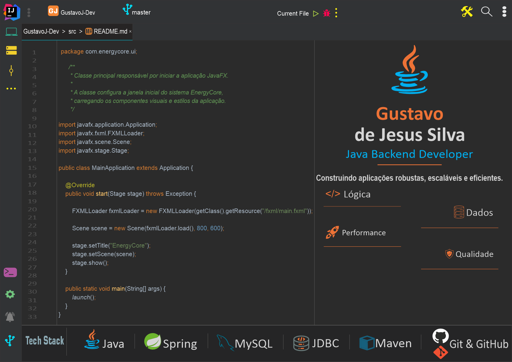

  

  

# 👋 Olá, eu sou Gustavo!

Sou estudante de **Análise e Desenvolvimento de Sistemas** e desenvolvedor focado em **Java Backend**.

Atualmente, concentro meus estudos no ecossistema Java, aprofundando meus conhecimentos em **Programação Orientada a Objetos**, **Collections Framework**, **Streams API**, **NIO.2**, **Concorrência** e **Estruturas de Dados**, aplicando esses conceitos em projetos práticos para desenvolver soluções robustas, escaláveis e bem estruturadas.

Meu objetivo é construir uma carreira sólida como desenvolvedor backend, evoluindo continuamente por meio do aprendizado constante, boas práticas de desenvolvimento e da criação de projetos que reflitam minha evolução técnica.
---

## 🚀 Tecnologias

 

---

## 📚 Atualmente estudando

No momento, estou aprofundando meus conhecimentos em **Multithreading**, **ExecutorService**, **Concorrência**, **Java NIO.2** e **Estruturas de Dados**, buscando compreender não apenas como utilizar essas tecnologias, mas também quando aplicá-las para desenvolver aplicações mais eficientes e escaláveis.

Meu próximo passo será iniciar os estudos em **Spring Boot**, expandindo meus conhecimentos em desenvolvimento backend e construção de APIs.

---

## 📂 Featured Repositories

### 📚 [JavaStudiesHub](https://github.com/GustavoJ-dev/JavaStudiesHub)

Meu principal repositório de estudos e evolução em Java, onde documento minha evolução por meio de exercícios, desafios e implementações práticas. O projeto reúne desde os fundamentos da linguagem até tópicos mais avançados, como Collections, Streams, NIO.2, Concorrência e Estruturas de Dados.

---

### 🧮 Scientific Calculator <!--(https://github.com/GustavoJ-dev/ScientificCalculator)-->

Calculadora científica desenvolvida em **JavaFX**, criada para aprofundar conhecimentos em interfaces gráficas, organização de código, eventos e manipulação de operações matemáticas em aplicações desktop.

---

### ☕ EnergyCore <!--(https://github.com/GustavoJ-dev/EnergyCore)-->

Projeto de gerenciamento de energia desenvolvido em **Java**, **JavaFX**, **JDBC** e **MySQL**. Criado para aplicar conceitos de arquitetura em camadas, persistência de dados e interfaces gráficas, continuará evoluindo à medida que eu aprofundar meus conhecimentos em desenvolvimento backend.

---

## 🎯 Objetivos

Atualmente, busco minha primeira oportunidade como desenvolvedor **Java Backend**, onde possa aplicar meus conhecimentos, contribuir com projetos reais e continuar evoluindo técnica e profissionalmente.

Acredito que o aprendizado contínuo, a prática constante e a construção de projetos sólidos são fundamentais para o desenvolvimento de uma carreira consistente na área de tecnologia.

---

## 📫 Contact

---

<!--
## 📊 GitHub Analytics

---

☕ **Code • Learn • Improve • Repeat**

-->