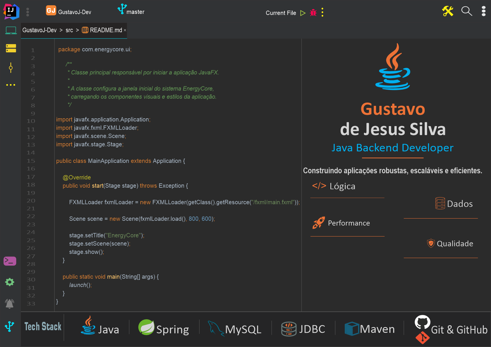

  

  

# 👋 Olá, eu sou Gustavo!

Sou desenvolvedor Java Backend, com foco no desenvolvimento de aplicações e APIs REST utilizando o ecossistema Java.

Atualmente, desenvolvo projetos utilizando Java, Spring Boot, Spring Data JPA, Hibernate, MySQL, OAuth 2.0 e JWT, aplicando conceitos de arquitetura em camadas, autenticação e autorização, persistência de dados, validação e boas práticas de desenvolvimento para construir APIs organizadas, seguras e de fácil manutenção.

Meu objetivo é evoluir continuamente como desenvolvedor backend, transformando conhecimento em projetos práticos e construindo uma carreira sólida por trás das de cada sistema feito.

---

## 🚀 Tecnologias e ferramentas

 

 

---

## 📚 Atualmente estudando

- Atualmente, meu foco está no desenvolvimento de APIs REST com Java e Spring Boot, colocando em prática os conhecimentos adquiridos e evoluindo continuamente por meio de projetos.

- Busco aprimorar aspectos como arquitetura, segurança, persistência de dados, qualidade de código e boas práticas, desenvolvendo aplicações cada vez mais completas e profissionais.

---

## 📂 Featured Repositories

### 📚 Java Studies Hub [JavaStudiesHub](https://github.com/GustavoJ-dev/JavaStudiesHub)

- Meu principal repositório de estudos e evolução em Java, onde documento minha evolução por meio de exercícios, desafios e implementações práticas. O projeto reúne desde os fundamentos da linguagem até tópicos mais avançados, como Collections, Streams, NIO.2, Concorrência e Estruturas de Dados, JDBC e JAVAFX.

---

### 🧮 Scientific Calculator [Calculadora Científica](https://github.com/GustavoJ-dev/ScientificCalculator)

- Calculadora científica desenvolvida em **JavaFX**, criada para aprofundar conhecimentos em interfaces gráficas, organização de código, eventos e manipulação de operações matemáticas em aplicações desktop, com mais de 14 operações e tratamentos de erros como divisão por 0 e INFINITY.

---

### ☕ PowerManager [PowerManager](https://github.com/GustavoJ-dev/PowerManager.git)
- API REST desenvolvida com Java e Spring Boot para gerenciamento de consumo de energia e faturamento, contemplando o controle de clientes, medidores, leituras de consumo, faturas, pagamentos e taxas.

- O projeto aplica conceitos de arquitetura em camadas, Spring Data JPA, Hibernate, MySQL, Bean Validation, tratamento de exceções e auditoria, com foco em organização, segurança, manutenibilidade e boas práticas no desenvolvimento de APIs backend.

---

## 🎯 Objetivos

- Busco minha primeira oportunidade como desenvolvedor Java Backend, onde possa contribuir com projetos reais, aplicar meus conhecimentos e agregar valor por meio de soluções bem estruturadas e boas práticas de desenvolvimento. Tenho como objetivo evoluir continuamente na área de tecnologia, unindo aprendizado, prática e desenvolvimento de projetos para construir uma trajetória sólida como profissional de software.
---

## 📫 Contact

---

## 📊 GitHub Analytics

---

☕ **Code • Learn • Improve • Repeat**

